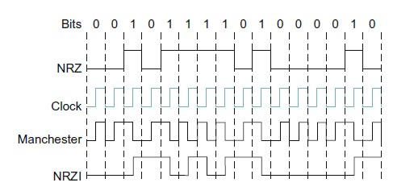

- Bit encoding for copper wire
    - Objective: create representations for 0's and 1's that transmit copper wire between end points.
    - Need for clock 
        High and low voltages are used to represent bits. However, voltage(power) are continuous signals, while bits are discrete. Thus, we need a clock at sender and a clock at the receiver to tell when the receiver should sample the signal. 
        The sample time is always between clock boundaries, not at clock boundary.

    - Clock synchronizaton 
        The clock at the sender and the receiver should be precisely synchronized so that the receiver can sample the signal at the right time. 
        How to synchronize the clock? A separate wire could be used for synchronization, but that would be expensive. Ideally, we want the *synchronizing signals* to be embedded in the *data signals*.  
    
    - Non-return to Zero (NRZ) 
        0: low voltage, 1: high voltage. 
        Problems:  
        1. The sender keeps track of an average of the signal it has seen so far and uses this average to distinguish between low and high signals. Whenever the signal is significantly lower than the average, the receiver concludes that it is a 0; and likewise for 1. The problem is that too many consecutive 1s or 0s cause this average to shift, making it harder to make the decision.

        2. Frequent transitions (from high to low or vice versa) are needed for clock synchronization. Long consecutive 1s or 0s leads to long time without transitions and can cause clock drift.  

    - Non-return to Zero Inverted (NRZ-I)  
        The sender makes a transition from the current stage to encode 1 and stay at current signal to encode 0.  
        NRZI solves the problem for consecutive 1s but not consecutive 0s.  

    - Manchester encoding  
        Low-to-high transition for 0 and high-to-low transition for 1.  
        Solves the problem for consecutive 1s and 0s.

- Clock signals 
    
    Clock signals have both rising (low to high) and falling (high to low) edges. One clock cycle consists of 1 rising edge and 1 falling edge. In any one of our encodings, we can choose to encode a bit using either edge or both edges, by triggering a transition on the clock edge(s).   

    In the case of NRZ, we only transition on the *falling* edges of the clock.  In the case of NRZ-I, we transition on *rising* edges of the clock.  These decisions are made purely by convention.  

    Manchester will always have a transition -- low-to-high for 0's or high-to-low for 1's on the *rising* edge of the clock as is shown in Figure 2.5.  Manchester may or may not have a transition on the falling edge of the clock depending on what the next bit in the sequence is. The receiver simply needs to look for transitions on the *rising* edge of its clock to decode the bit.

- How clock synchronization (clock recovery) works?